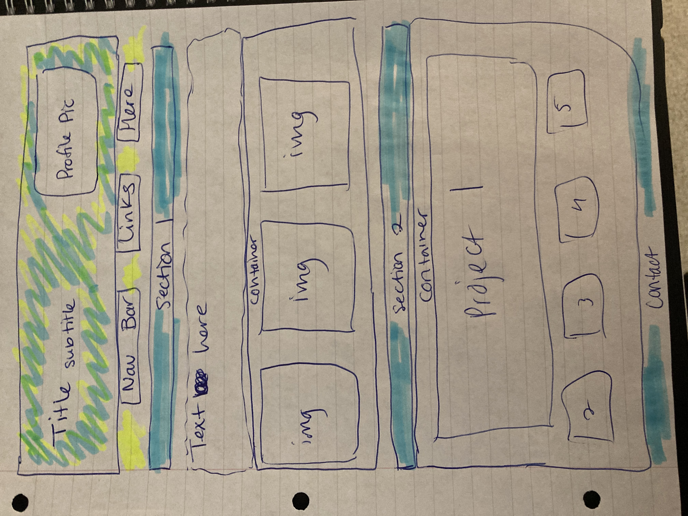

# Homework02

## Web Development Portfolio - Sandy Marr

Welcome to my portfolio for projects in web development and coding. In creating this page, I started out with a sketch to determine the overall layout and funtionality of the page. 

From there, I developed a skeleton structure in html in order to start working on the page layout with css. 

Once the baseline for html and css was in place, I was able to work through an iterative process until the page looked and reacted as intended. This included simple updates in the css and html files before saving and refreshing the page, as well as the use of chrome dev tools to see any impacts live before implementing them. 

There are areas where I plan to make improvements as new skills are learned, but for now, I am excited that I was able to build a page from scratch. 

Dive in! https://sandra-marr.github.io/Homework02/

